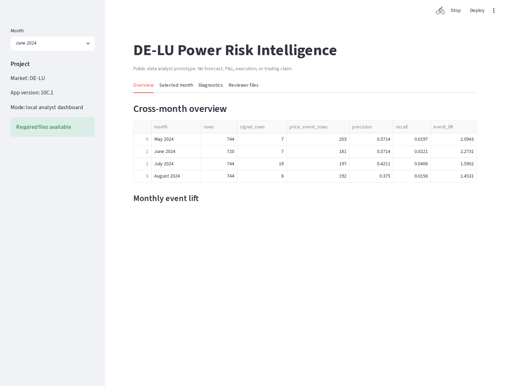
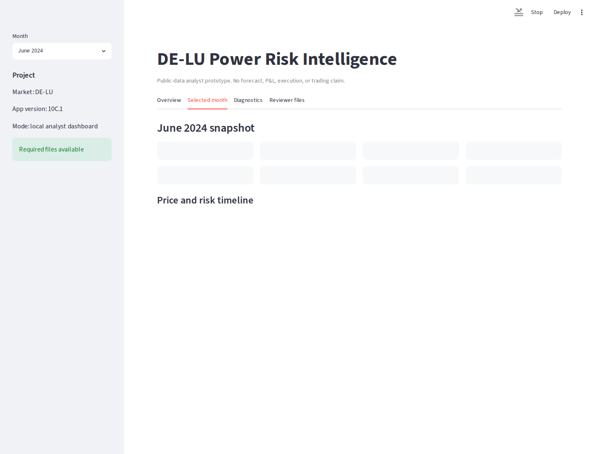
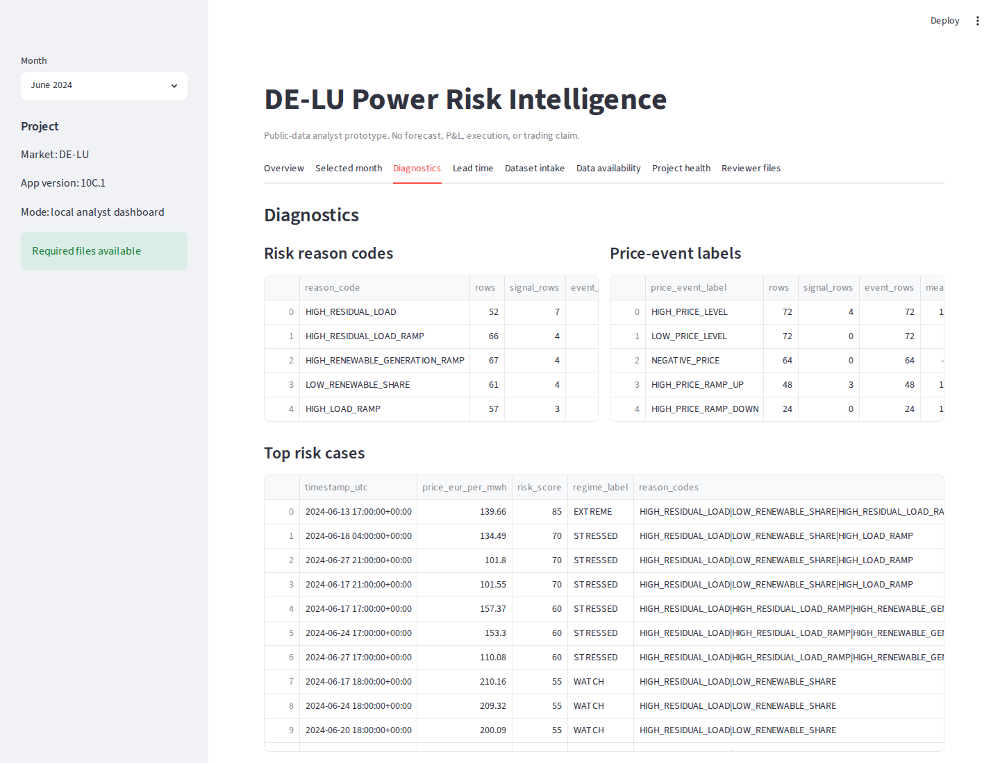
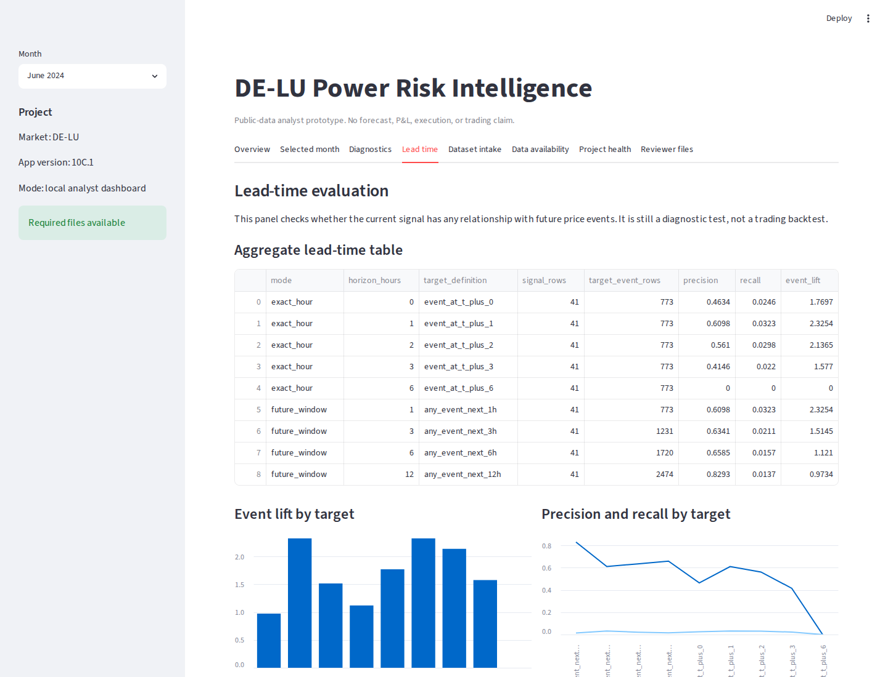
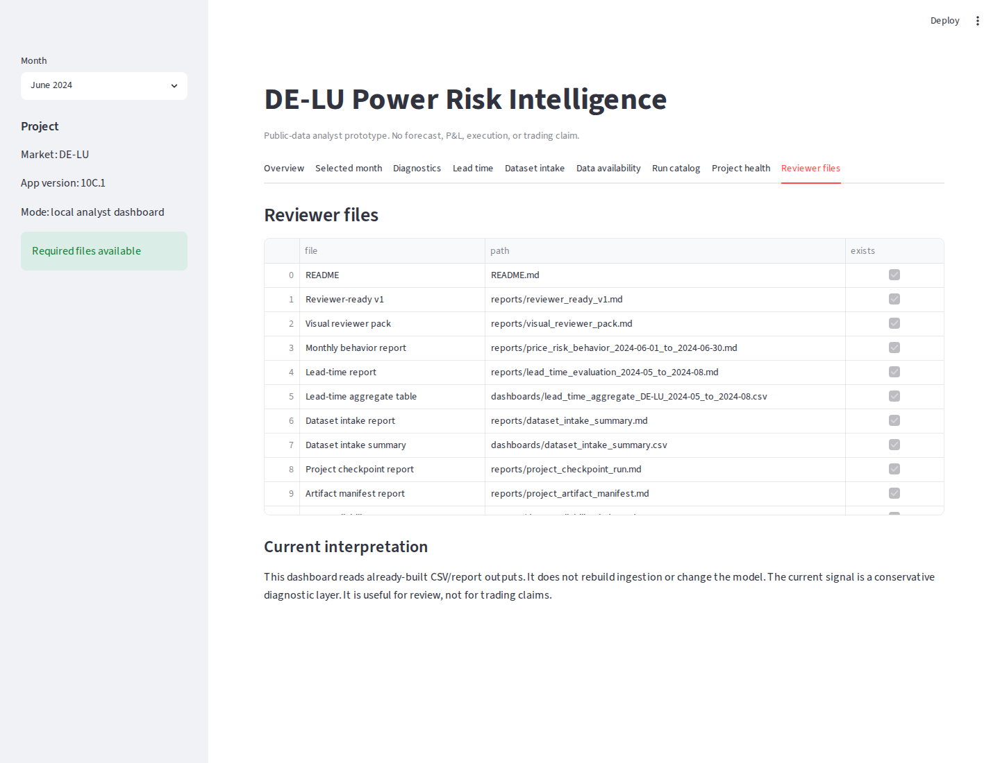

# DE-LU Power Risk Intelligence

A small public-data pipeline for German/Luxembourg power-market risk analytics.

The project ingests SMARD data, builds a clean hourly market table, derives load, renewable and residual-load features, exports dashboard-ready files, and creates a first rule-based stress signal.

It is not a trading bot. It does not claim P&L, price forecasting ability, execution logic, or a profitable strategy.

## Current pipeline

SMARD raw data
→ clean hourly staging
→ staging checks
→ feature table
→ SQL / Power BI export files
→ rule-based risk signals
→ risk diagnostics
→ reviewer pack

Current automated scope stops at risk diagnostics and reviewer-pack generation. Event-study and backtest modules are intentionally not enabled yet.

## Quick start

Install dependencies:

    pip install -r requirements.txt

Run tests:

    python -m pytest

Run the sample pipeline:

    bash scripts/run_sample_pipeline.sh

Or, if make is available:

    make sample

Dry-run the plan without executing it:

    python -m src.orchestration.run_all --config config/pipeline_sample.yaml --dry-run

## Sample window

Default sample run:

    market_label: DE-LU
    smard_region: DE
    start: 2024-06-01
    end: 2024-06-03
    resolution: hour

This is a short technical sample, not a performance study.

## Main outputs

    data/staging/clean_hourly_DE-LU_2024-06-01_to_2024-06-03.csv
    data/processed/hourly_features_DE-LU_2024-06-01_to_2024-06-03.csv
    data/processed/risk_signals_DE-LU_2024-06-01_to_2024-06-03.csv
    dashboards/market_overview_DE-LU_2024-06-01_to_2024-06-03.csv
    dashboards/risk_regime_distribution_DE-LU_2024-06-01_to_2024-06-03.csv
    dashboards/top_risk_hours_DE-LU_2024-06-01_to_2024-06-03.csv
    reports/reviewer_pack_2024-06-01_to_2024-06-03.md
    reports/pipeline_run_summary_2024-06-01_to_2024-06-03.md
    sql/schema_power_market_features.sql

## Signal logic

The current risk signal uses:

- residual load
- renewable share
- load ramp
- residual-load ramp
- renewable-generation ramp

The rules are simple and explainable. They are a first stress proxy, not a finished desk model.

## Current limitations

- only SMARD data is used
- no price data yet
- no forecast error data yet
- no balancing-market layer yet
- no weather, outage, or cross-border flow layer yet
- no backtest in the automated pipeline
- no P&L or trading-performance claim

## Reviewer entry point

Start with:

    reports/reviewer_pack_2024-06-01_to_2024-06-03.md

Then check:

    reports/risk_diagnostics_2024-06-01_to_2024-06-03.md
    dashboards/top_risk_hours_DE-LU_2024-06-01_to_2024-06-03.csv
    src/signals/risk_engine.py

Useful reviewer question:

Is this feature framing directionally useful for power trading analytics, or is the rule logic still too simple compared with how a real desk would look at residual load, renewables and ramps?

## Project status

The current build is a reproducible analytics prototype. The next serious step is a longer historical run, followed by a careful event/backtest layer.

## Dashboard screenshots

The project also includes a lightweight local Streamlit dashboard for reviewing the current analytics outputs.

Run:

    streamlit run app/streamlit_app.py

### Dashboard overview

### Selected month view

### Diagnostics view

### Lead-time view

### Reviewer files view

## Local dashboard

A lightweight Streamlit dashboard is available for local review.

Run:

    streamlit run app/streamlit_app.py

Current dashboard panels:

- cross-month overview
- monthly event lift
- base event rate versus signal-positive event rate
- selected month KPI cards
- price and risk timelines
- confusion buckets
- signal-positive hours
- reason-code diagnostics
- price-event label diagnostics
- reviewer file checklist

The dashboard reads existing CSV/report outputs. It does not rebuild ingestion and does not change the model.

See:

    docs/dashboard_runbook.md
    docs/dashboard_screenshot_guide.md

## Reviewer-ready v2

The current reviewer checkpoint includes both same-hour signal-price evaluation and lead-time diagnostics.

Key points:

- Same-hour aggregate event lift: 1.770
- Aggregate precision: 0.463
- Aggregate recall: 0.025
- Same-hour lift is useful as a diagnostic readout.
- Lead-time behavior is now explicitly checked before making any early-warning claim.

Lead-time readout:

Lead-time check shows some forward-window event concentration, especially within the next 3 hours. This is still not forecast skill and needs longer-window validation.

Main file:

    reports/reviewer_ready_v2.md

